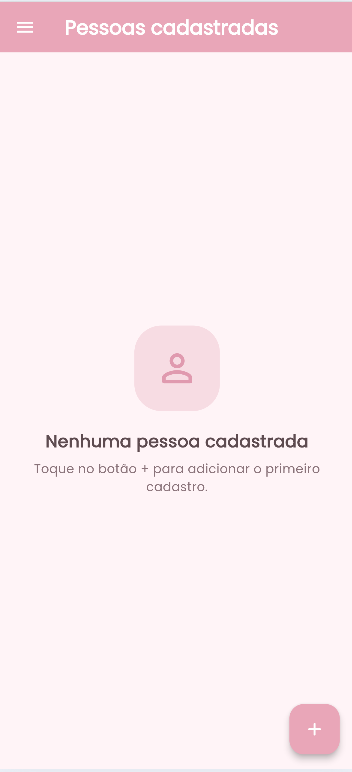
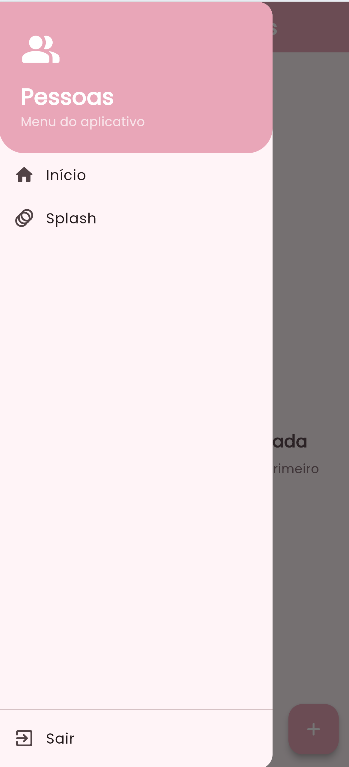
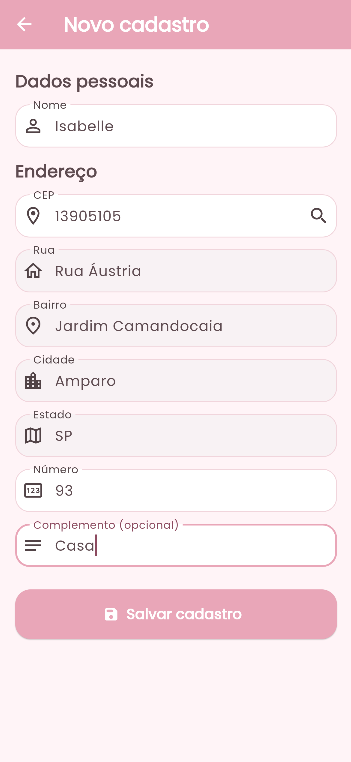
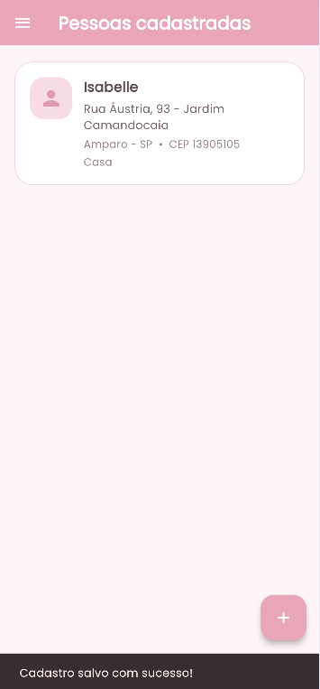

# 📱 Cadastro de Pessoas

Aplicativo desenvolvido em **Flutter** para a atividade **Aula 04 – Consumo de APIs externas**, **Situação Desafiadora 1**, do curso de **Desenvolvimento de Sistemas**.

O aplicativo permite cadastrar pessoas, consultar automaticamente os dados de endereço através do **CEP** e salvar os cadastros localmente no dispositivo.

---

## ✨ Funcionalidades

* 🌸 Splash Screen com animação de entrada e saída.
* 🏠 Tela inicial com cabeçalho e lista de pessoas cadastradas.
* ☰ Menu lateral de navegação.
* ➕ Botão para realizar um novo cadastro.
* 👤 Cadastro de nome, CEP, número e complemento.
* 📍 Consulta automática do CEP através da API **ViaCEP**.
* 🏡 Preenchimento automático de rua, bairro, cidade e estado.
* 💾 Salvamento dos cadastros localmente no celular.
* 🔄 Acesso à Splash Screen através do menu.
* 🚪 Opção para sair do aplicativo.
* 🎨 Interface com tema claro, cores delicadas e fonte do Google Fonts.
* 📱 Ícone personalizado para o aplicativo.

---

## 🛠️ Tecnologias utilizadas

| Tecnologia             | Utilização                           |
| ---------------------- | ------------------------------------ |
| **Flutter**            | Desenvolvimento do aplicativo        |
| **Dart**               | Linguagem de programação             |
| **ViaCEP**             | Consulta de endereços através do CEP |
| **HTTP**               | Comunicação com a API                |
| **Shared Preferences** | Armazenamento local dos cadastros    |
| **Google Fonts**       | Fonte utilizada na interface         |

---

## 🚀 Como executar o projeto

### 1. Instalar as dependências

```bash
flutter pub get
```

### 2. Executar o aplicativo

```bash
flutter run
```

### 3. Gerar o ícone do aplicativo

Caso o arquivo `assets/icon.png` seja alterado, execute:

```bash
dart run flutter_launcher_icons
```

### 4. Gerar o APK

Para gerar a versão de lançamento do aplicativo:

```bash
flutter build apk --release
```

O arquivo será gerado em:

```text
build/app/outputs/flutter-apk/app-release.apk
```

---

## 📱 APK

A versão **Release** do aplicativo está disponível para download:

### [⬇️ Baixar o APK](./apk/app-release.apk)

**Arquivo:** `app-release.apk`

O APK pode ser instalado em um dispositivo Android ou executado em um emulador.

---

## 🖼️ Imagens do Sistema

Abaixo estão algumas telas do aplicativo:

### 🌸 Splash Screen


### 🏠 Tela Inicial



### ☰ Menu Lateral



### 👤 Cadastro de Pessoa



### 📍 Consulta de CEP



---

## 📂 Estrutura do Projeto

```text
lib/
├── models/
│   └── pessoa.dart
├── screens/
│   ├── splash_screen.dart
│   ├── home_screen.dart
│   └── cadastro_screen.dart
├── services/
│   ├── cep_service.dart
│   └── pessoa_service.dart
└── main.dart

assets/
├── icon.png
├── 1.png
├── 2.png
├── 3.png
├── 4.png
└── 5.png
```

---

## 👩‍💻 Desenvolvimento

Projeto desenvolvido como parte das atividades do curso de **Desenvolvimento de Sistemas – SENAI/SESI**.
